## Welcome
You now have access to this Gitlab repository, specifically set up for you. In this repository you will find a project which emulates the backend technology stack we use.

## The Tech-Stack
The repository presented to you is set up with

**Backend**
- [**Docker**](https://www.docker.com) as the build tool
- [**Python3**](https://www.python.org) as the backend programming language
- [**PostgreSQL**](https://www.postgresql.org) as the relational database
- [**psycopg2**](https://www.psycopg.org/docs/) as PostgreSQL database adapter 
- [**pytest**](https://docs.pytest.org/en/6.2.x/) for unit testing
- [**pylint**](https://pylint.org) as python static code analysis tool

This setup is very close to the tech stack we work with, so it is intentional to 
expose you to a development experience backend engineers encounter on a daily basis.
However, we want to give you the liberty to change parts of the stack to your liking if reasonable.

## Working with Git
As you have noticed, you are not simply given a code base to modify, but full access to a repository.
Part of the exercise is to demonstrate proficiency in working with git.
The project's main branch main is protected, meaning that you are required to check out a new branch.
It is expected from you that all code changes are being commit and finally pushed on your own branch.

## The Task
You are provided with the task of designing a small pipeline to load in customer data for a new app 
in development. The app collects information about various companies, including how much electricity
they consumed per year. To store the necessary information, a postgres database is being used, which stores 
a schema __app__, containing two tables __customers__ and __electricity_cost__.
The definition of the tables can be found in ___backend/setup/init_db.sql___. 
Table __app.customers__ should contain all the information per customer, table __app.electricity_cost__ already
contains the electricity cost per City and year (see table __app.electricity_cost__).

The data which should be loaded is provided in ___source_data/customer_data.csv___ and 
represents a small sample of how the actual file will look like (assume > 1.000.000 rows).
The content of the larger file will be identical to the smaller sample, so it can be assumed that no
extra processing would be needed to account for cases not present in the sample file.

Your task is to:
1. extract the necessary information from the csv-file and load it into a workable environment of your choice.
   1. If you struggle with reading the file, you can alternatively use the table __backup.source_data__ and proceed from there.
2. Validate and sanitise the data provided. If values are missing, make reasonable assumptions or filter the incomplete rows, your choice.
3. Fill the target table with the sanitised data and calculate the resulting electricity cost

To connect to the database you can use a database connection via psycopg2, provided in ___backend/db_connectors/db_connection.py___,
although if you want to use any alternative you can do so.

## Starting the Task

### Gitpod
We recommend using Gitpod. Gitpod provides a browser based VScode IDE with an environment setup for you, so you can immediately
start coding and don't have to setup anything locally :).
It is recommended to use Chrome when working with Gitpod to ensure a smooth experience.
In Gitpods web-IDE Node and npm are already available, and you have a terminal window for interacting with it.
When you open your project in gitlab, select the downward arrow next to `Web IDE`, then select Gitpod and click on the Gitpod button.

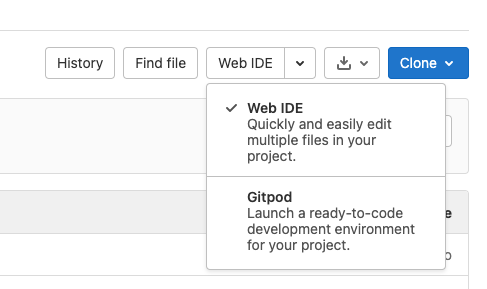

Click on the Gitpod-Button to open the online IDE. When opening Gitpod for the first time, you are asked to allow the Gitpod-integration.
Confirm and then click the Gitpod button again.

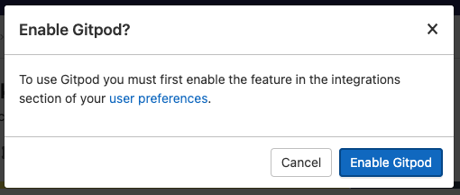

This will open the project in your browser. When asked with which account to login, select the Gitlab option.

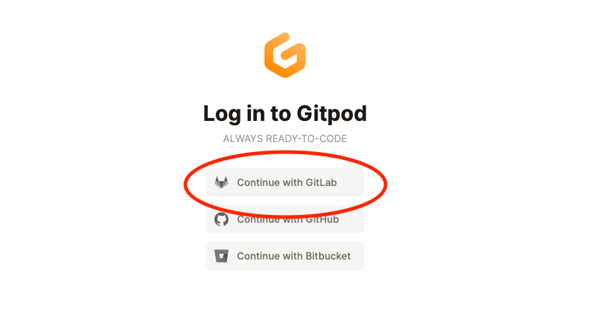

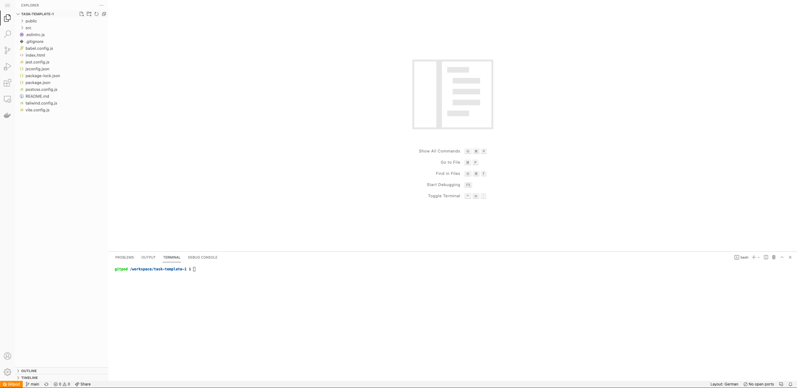

Gitpod is set up to install the node packages automatically and start the server.
It can happen that the popup blocker of your browser prevents the application from opening.
In that case you can manually tell the popup blocker to allow the new page to open or to restart the dev server with `npm run dev`.

### Using Git functionality in Gitpod
How you create new branches is up to you. You can use git in the CLI, Gitlab or Gitpod (or any other tool you like).
If you opened Gitpod and you had main selected, then in the bottom left corner you will see the label main.
Click on this label and a panel appears which allows you to create a new branch.

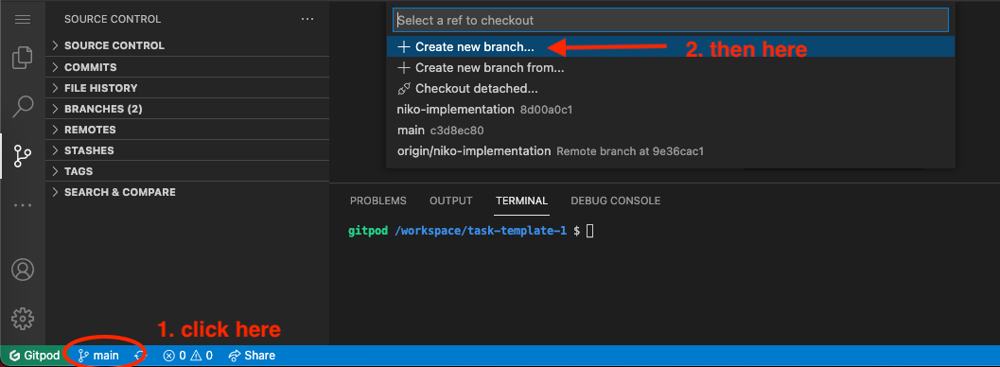
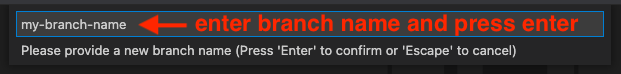

For pushing and pulling to and from the Gitlab server you can use the button next to the branch name.

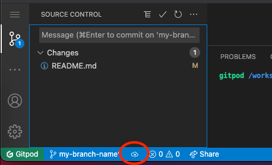

It might happen that Gitpod throws the following message.

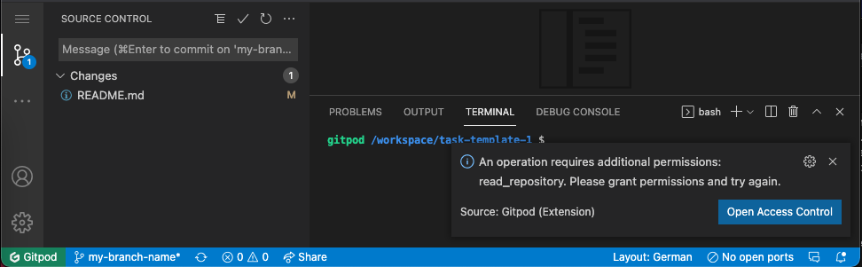

This message will appear every time you push or pull. You can simply ignore this warning.
The action should successfully arrive at Gitlab's server. If you are unsure, you can check whether you see the new branch
in your assessment repository.

### Starting docker
Next step is to start your docker containers, which will host both the postgres database and your backend application. 
First, open a terminal and run `docker compose build`. This will build the necessary images to create the containers.
Next, start your containers by running `docker compose up -d`. You should now see two running containers, which you can
validate by running `docker compose ps`.

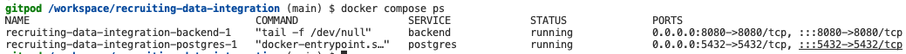

#### Executing code
Python code can be run from inside the backend container. To enter the container, run `docker compose exec backend bash`.
You can verify that everything is working out correctly by running `python3 backend/main.py`,
which should print a _hello world_ message for you:

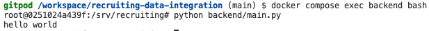

#### Looking into the postgres database
Running code is essential to being able to complete the challenge, but it is also necessary to look at and validate the
content that is being stored in the database. For this, you need to enter the postgres container, which can be done by 
running `docker compose exec postgres bash` in a separate terminal. There is a very helpful tool called `psql`, which lets
you interact with the database in a direct way from the terminal. It can be enabled by running `psql --username postgres postgres`.

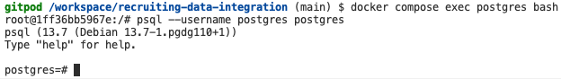

You can now run queries directly from your console! For example, you can look at a table definition with `\d+ app.customers`:

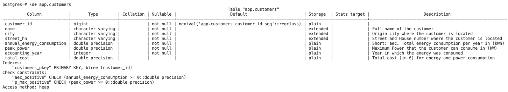

Or query tables directly: `SELECT * FROM app.electricity_cost;`

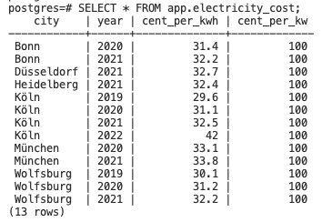

## Final Words
And that is it! The rest is up to you now, we hope everything up until now worked out smoothly, so you can totally focus
on finishing the task in your best possible way, good luck!
